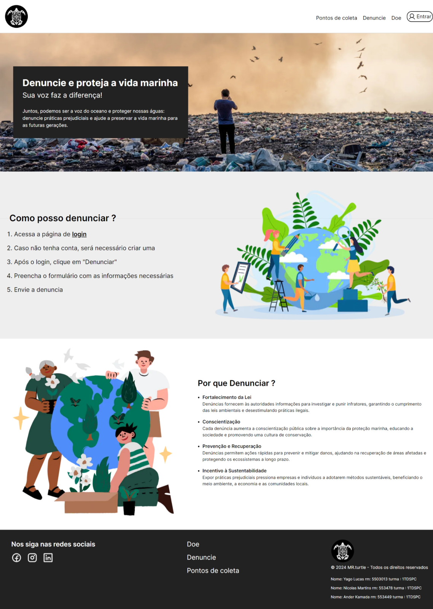

# Projeto Mr. Turtlle - Global Solution

## Descrição do Projeto desenvolvido em Java

Nosso projeto tem como objetivo realizar operações de inserção, recuperação, atualização e remoção de dados em um banco de dados Oracle. 
O nosso projeto está integrado com o front end e recebe requisições do mesmo para capturar informações que estão no banco de dados e tambem para inserir novas informações no banco de dados.

## Passo a passo para rodar o projeto

Lembrando que para rodar o projeto é necessário ter o Java instalado na sua máquina, caso não tenha, você pode baixar o Java no site oficial da Oracle.

1. Clone o repositório do projeto
2. Abra o projeto em uma IDE de sua preferência
3. Navegue até a classe `main` e rode a aplicação
4. A aplicação estará rodando na porta `8080` do seu localhost

## Endpoints

http://localhost:8080/denuncia  
Responsável por adicionar e ler todas as denuncias

http://localhost:8080/denuncia/usuario  
Responsável por ler todas as denuncias de um usuário específico

http://localhost:8080/doacao  
Responsável por adicionar, ler todas as doações e ler doações específicas  

http://localhost:8080/usuario  
Responsável por adicionar, ler todos os usuários e ler usuários específicos  

http://localhost:8080/fakecompany  
Responsável por ler todas as empresas da api que consumimos no Java

## Links uteis
Link do repositório do projeto: https://github.com/yagoluucas/java-global

## Diagrama de classes UML

## Apis consumidas

Dentro da nossa pacote infrastruture, temos uma classe chamada FakeCompanyService que é responsável por consumir a api de empresas fakes.  
Lá tambem temos uma classe que usamos para gerar o qr code através de uma outra api

## Telas do front end

Abaixo é possível ver todas as tela que fizemos no front end e que grande parte terá interação com o back end

### Tela principal

### Tela de denúncias

### Tela de registrar denuncia

### Tela de doações

### Tela de login

### Tela de cadastro

## Arquivo de logs

Dentro do nosso projeto temos um arquivo chamado `logs.log` que é responsável por armazenar todos os logs que são gerados na aplicação.  
Caso ocorra algum erro, é possível verificar o que aconteceu através desse arquivo.  
Ele está localizado dentro da pasta logs

